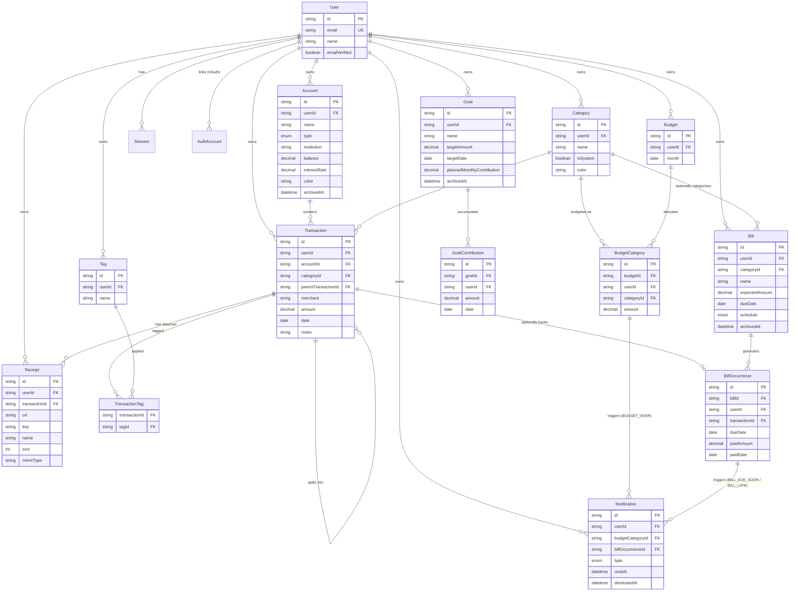

# FinanceOS — ER Diagram (Phase 0 + Phase 1 + Phase 2)

## Design notes (Phase 0/1)

- **`Account.type` is a single enum** covering all seven account kinds (checking → crypto) rather than separate tables per type. This is deliberate (risk-register.md #1): Phase 3's Debt Tracker and Investments features will extend the *same* `Account` rows (e.g. a `CREDIT_CARD` account gains debt-specific fields via a related `DebtDetail` table in Phase 3, not a schema rewrite).
- **`Account` is soft-deleted** (`archivedAt`) — a hard delete would cascade-orphan transaction history needed for lifetime analytics and tax reports (Phase 4).
- **`Category` is per-user, not global**, with an `isSystem` flag distinguishing the Charter's fixed 11-category starter set (seeded automatically per user at signup, via a Better Auth `databaseHooks.user.create.after` hook — see `src/features/categories/default-categories.ts`) from user-added categories. This trades a small amount of row duplication for simplicity: every user can freely rename/delete their own categories without a global-vs-personal-override system.
- **Split transactions are self-referential** on `Transaction` (`parentTransactionId`). A sum-equals-parent-amount constraint is enforced in application code (`features/transactions/server/actions.ts`), not the database, since Prisma/Postgres can't express a cross-row aggregate check constraint declaratively without a trigger.
- **`TransactionTag` is an explicit join table**, not Prisma's implicit m-n, so it can grow fields (e.g. `taggedAt`) without a migration that changes the relation's shape.
- **Better Auth's `User`/`Session`/`AuthAccount`/`Verification` models** use the exact field names/table mappings the adapter expects — do not rename without checking Better Auth's Prisma adapter docs first.

## Design notes (Phase 2)

- **`Transaction.receiptUrl` (Phase 1 placeholder) was dropped**, replaced by the one-to-many `Receipt` model below. It could only ever represent a single file and couldn't satisfy the receipt-attachment addendum's "attach one or more files" requirement. Safe to drop outright (not a two-migration rename) since no production data existed and no Phase 1 UI ever wrote to it.
- **Budgeting: "unset" vs. "set to $0" is modeled as row presence, not a nullable column.** No `BudgetCategory` row for a given `(budgetId, categoryId)` means the category has no allocation this month; a row with `amount: 0` means the user deliberately set zero. A lightweight `Budget` "header" row (one per user per calendar month, `@@unique([userId, month])`) anchors each month and lets `getBudgetMonth` answer "was this month ever materialized" (→ real history vs. "no budget was set this month") from the header row's mere existence, without scanning `BudgetCategory`.
- **Savings Goals have no `Account` linkage anywhere** (resolved product decision, 2026-07-19): progress is derived only from `GoalContribution` rows, never a derived account balance, avoiding two independently-maintained numbers drifting or double-counting. `currentProgress`/`percentComplete`/`isCompleted`/`estimatedCompletion` are all computed at read time in `features/goals/server/service.ts`, never stored.
- **Bills use lazy, on-read occurrence generation** (not eager generation of all future occurrences at create/edit time — recurring bills like weekly subscriptions have no natural end date). `BillOccurrence` has `@@unique([billId, dueDate])` so the generator is naturally idempotent across repeated reads. Occurrence status (Upcoming/Due Today/Late/Paid) is never a stored column — always computed at read time from `dueDate`/`paidAmount`/`paidDate`/`transactionId`.
- **A `BillOccurrence` may optionally link to an existing `Transaction`** (resolved product decision, 2026-07-19, over "stay fully separate" and "auto-create a transaction"): `transactionId` is a nullable, unique FK (`onDelete: SetNull`) — at most one Transaction backs one occurrence, enforced at the database level. When linked, the occurrence's effective paid amount/date are read live via the join, never copied, so editing the linked Transaction is automatically reflected with zero write-side sync code; deleting the linked Transaction reverts the occurrence to unpaid.
- **`Notification` is persisted and lazily materialized**, not purely computed at read time or backed by a background job (this app has no job infrastructure). A compute-only design couldn't satisfy the durable-dismiss requirement (dismissing a notification must stick even though its underlying trigger condition hasn't changed) or the per-category/per-occurrence dedup rules — both need a stable row identity, enforced via `@@unique([budgetCategoryId, type])` and `@@unique([billOccurrenceId, type])`.
- **Every new Phase 2 model repeats the direct `userId` FK + index convention** already established in Phase 1 (e.g. `BudgetCategory.userId`, `BillOccurrence.userId`), even where the ownership is also reachable via a parent join (`Budget`, `Bill`) — keeps every user-scoped query and row-level ownership check a single-column lookup, no join required, consistent with how `Transaction.userId` already duplicates what `Transaction.accountId` implies.
