# FinanceOS — ER Diagram (Phase 0 + Phase 1 + Phase 2 + Phase 3a + Phase 3b + Phase 4a)

```mermaid
erDiagram
    User ||--o{ Account : owns
    User ||--o{ Transaction : owns
    User ||--o{ Category : owns
    User ||--o{ Tag : owns
    User ||--o{ Session : has
    User ||--o{ AuthAccount : "links (OAuth)"
    User ||--o{ Budget : owns
    User ||--o{ Goal : owns
    User ||--o{ Bill : owns
    User ||--o{ Notification : owns
    User ||--o{ Receipt : owns

    Account ||--o{ Transaction : contains

    Category ||--o{ Transaction : classifies
    Category ||--o{ BudgetCategory : "budgeted as"
    Category ||--o{ Bill : "optionally categorizes"

    Transaction ||--o{ Transaction : "splits into"
    Transaction ||--o{ TransactionTag : tagged
    Tag ||--o{ TransactionTag : applied
    Transaction ||--o{ Receipt : "has attached"
    Transaction ||--o| BillOccurrence : "optionally backs"

    Budget ||--o{ BudgetCategory : allocates
    BudgetCategory ||--o{ Notification : "triggers (BUDGET_OVER)"

    Goal ||--o{ GoalContribution : accumulates

    Bill ||--o{ BillOccurrence : generates
    BillOccurrence ||--o{ Notification : "triggers (BILL_DUE_SOON / BILL_LATE)"

    User ||--o{ Debt : owns
    User ||--o{ Holding : owns
    User ||--o{ HoldingValueHistoryEntry : owns
    User ||--o{ DividendEntry : owns
    User ||--o{ IncomeStream : owns
    User ||--o{ IncomeOccurrence : owns
    User ||--o{ IrregularIncomeEvent : owns
    User ||--o{ NetWorthSnapshot : owns

    Account ||--o| Debt : "optionally linked to (Credit Card only)"
    Account ||--o{ Holding : contains

    Holding ||--o{ HoldingValueHistoryEntry : "records value changes"
    Holding ||--o{ DividendEntry : "receives dividends"

    IncomeStream ||--o{ IncomeOccurrence : generates
    IncomeStream ||--o{ IrregularIncomeEvent : logs

    Transaction ||--o| IncomeOccurrence : "optionally backs"
    Transaction ||--o| IrregularIncomeEvent : "optionally backs"

    User ||--o{ FinancialGoal : owns
    User ||--o{ DismissedSubscriptionMerchant : owns

    Debt ||--o{ FinancialGoal : "optionally targeted by (DEBT_PAYOFF)"
    FinancialGoal ||--o{ FinancialGoalAccount : "optionally scoped to (ACCOUNT_SUBSET)"
    Account ||--o{ FinancialGoalAccount : "optionally included in"

    User ||--o{ CategorySuggestion : owns
    User ||--o{ BudgetAdvisorCache : owns
    User ||--o{ MonthlySummary : owns
    User ||--o{ SpendingInsightsCache : owns
    User ||--o{ FinancialHealthScoreSnapshot : owns

    Transaction ||--o{ CategorySuggestion : "suggested for"
    Category ||--o{ CategorySuggestion : "optionally suggested (nullable, SetNull)"

    User {
        string id PK
        string email UK
        string name
        boolean emailVerified
    }

    Account {
        string id PK
        string userId FK
        string name
        enum type
        string institution
        decimal balance
        decimal interestRate
        string color
        datetime archivedAt
    }

    Category {
        string id PK
        string userId FK
        string name
        boolean isSystem
        string color
    }

    Tag {
        string id PK
        string userId FK
        string name
    }

    Transaction {
        string id PK
        string userId FK
        string accountId FK
        string categoryId FK
        string parentTransactionId FK
        string merchant
        decimal amount
        date date
        string notes
    }

    TransactionTag {
        string transactionId FK
        string tagId FK
    }

    Budget {
        string id PK
        string userId FK
        date month
    }

    BudgetCategory {
        string id PK
        string budgetId FK
        string userId FK
        string categoryId FK
        decimal amount
    }

    Goal {
        string id PK
        string userId FK
        string name
        decimal targetAmount
        date targetDate
        decimal plannedMonthlyContribution
        datetime archivedAt
    }

    GoalContribution {
        string id PK
        string goalId FK
        string userId FK
        decimal amount
        date date
    }

    Bill {
        string id PK
        string userId FK
        string categoryId FK
        string name
        decimal expectedAmount
        date dueDate
        enum schedule
        datetime archivedAt
    }

    BillOccurrence {
        string id PK
        string billId FK
        string userId FK
        string transactionId FK
        date dueDate
        decimal paidAmount
        date paidDate
    }

    Notification {
        string id PK
        string userId FK
        string budgetCategoryId FK
        string billOccurrenceId FK
        enum type
        datetime readAt
        datetime dismissedAt
    }

    Receipt {
        string id PK
        string userId FK
        string transactionId FK
        string url
        string key
        string name
        int size
        string mimeType
    }

    Debt {
        string id PK
        string userId FK
        string accountId FK "nullable, unique"
        string name
        enum type
        decimal balance
        decimal interestRate
        decimal minimumPayment
        datetime archivedAt
    }

    Holding {
        string id PK
        string userId FK
        string accountId FK
        string name
        enum assetType
        enum sector "nullable"
        decimal costBasis
        decimal currentValue
        datetime closedAt
    }

    HoldingValueHistoryEntry {
        string id PK
        string userId FK
        string holdingId FK
        decimal previousValue
        decimal newValue
        datetime recordedAt
    }

    DividendEntry {
        string id PK
        string userId FK
        string holdingId FK
        decimal amount
        date date
    }

    IncomeStream {
        string id PK
        string userId FK
        string name
        enum type
        enum schedule
        decimal expectedAmount "nullable"
        date anchorDate "nullable"
        datetime archivedAt
    }

    IncomeOccurrence {
        string id PK
        string streamId FK
        string userId FK
        string transactionId FK "nullable, unique"
        date expectedDate
        decimal receivedAmount
        date receivedDate
    }

    IrregularIncomeEvent {
        string id PK
        string streamId FK
        string userId FK
        string transactionId FK "nullable, unique"
        decimal amount
        date date
    }

    NetWorthSnapshot {
        string id PK
        string userId FK
        datetime capturedAt
        date capturedDate "unique per user, per day"
        decimal totalAccountBalance
        decimal totalUnlinkedDebtLiability
        decimal totalNetWorth
    }

    DismissedSubscriptionMerchant {
        string id PK
        string userId FK
        string normalizedMerchantName
        datetime dismissedAt
    }

    FinancialGoal {
        string id PK
        string userId FK
        string linkedDebtId FK "nullable, DEBT_PAYOFF only"
        string name
        enum type
        decimal startingBalance "nullable, DEBT_PAYOFF only"
        decimal targetAmount "nullable, NET_WORTH_SAVINGS_TARGET only"
        enum measurementBasis "nullable, NET_WORTH_SAVINGS_TARGET only"
        decimal targetPercent "nullable, SAVINGS_RATE_TARGET only"
        date targetDate "nullable, SAVINGS_RATE_TARGET only"
        datetime archivedAt
    }

    FinancialGoalAccount {
        string financialGoalId FK
        string accountId FK
    }

    CategorySuggestion {
        string id PK
        string userId FK
        string transactionId FK
        string suggestedCategoryId FK "nullable"
        enum status
        enum source
        decimal confidence "nullable, 0.00-1.00"
        string generatorModel
        datetime shownAt "nullable"
        datetime resolvedAt "nullable"
        datetime createdAt "generation timestamp"
    }

    BudgetAdvisorCache {
        string id PK
        string userId FK
        date month "unique per user, per month"
        json recommendations "nullable"
        datetime generatedAt
    }

    MonthlySummary {
        string id PK
        string userId FK
        date month "unique per user, per month"
        string narrative "nullable"
        json citedFigures "nullable"
        boolean isPartialMonth
        datetime generatedAt
        datetime createdAt
    }

    SpendingInsightsCache {
        string id PK
        string userId FK
        string period "unique per user, per period key"
        json insights "nullable"
        datetime generatedAt
    }

    FinancialHealthScoreSnapshot {
        string id PK
        string userId FK
        datetime capturedAt
        date capturedDate "unique per user, per day"
        int debtToIncomeScore "nullable"
        int savingsRateScore "nullable"
        int budgetAdherenceScore "nullable"
        int netWorthTrendScore "nullable"
        int totalScore "nullable"
        enum label "nullable"
        string narrative "nullable"
    }
```



## Design notes (Phase 0/1)

- **`Account.type` is a single enum** covering all seven account kinds (checking → crypto) rather than separate tables per type. This is deliberate (risk-register.md #1): Phase 3a's Debt Tracker and Investments features extend this design without a schema rewrite. **Correction to this note's original wording (Database Architect, Phase 3a):** the parenthetical above ("a `CREDIT_CARD` account gains debt-specific fields via a related `DebtDetail` table") was illustrative precedent only, written before any Phase 3a product spec existed, and was explicitly flagged by the Product Owner as non-binding (see Architecture.md's "Phase 3a — the Account-linkage handoff"). The actual Phase 3a decision, made fresh against `debt-tracker.md`/`investments.md`, is different in shape: **no `DebtDetail` table exists.** Debt is a standalone `Debt` model with an optional link to `Account` (see "Design notes (Phase 3a)" below for the full reasoning) — not fields grafted onto `Account` itself. This bullet is left here, corrected, rather than deleted, so a future reader searching for "DebtDetail" finds the correction instead of a dangling reference.
- **`Account` is soft-deleted** (`archivedAt`) — a hard delete would cascade-orphan transaction history needed for lifetime analytics and tax reports (Phase 4).
- **`Category` is per-user, not global**, with an `isSystem` flag distinguishing the Charter's fixed 11-category starter set (seeded automatically per user at signup, via a Better Auth `databaseHooks.user.create.after` hook — see `src/features/categories/default-categories.ts`) from user-added categories. This trades a small amount of row duplication for simplicity: every user can freely rename/delete their own categories without a global-vs-personal-override system.
- **Split transactions are self-referential** on `Transaction` (`parentTransactionId`). A sum-equals-parent-amount constraint is enforced in application code (`features/transactions/server/actions.ts`), not the database, since Prisma/Postgres can't express a cross-row aggregate check constraint declaratively without a trigger.
- **`TransactionTag` is an explicit join table**, not Prisma's implicit m-n, so it can grow fields (e.g. `taggedAt`) without a migration that changes the relation's shape.
- **Better Auth's `User`/`Session`/`AuthAccount`/`Verification` models** use the exact field names/table mappings the adapter expects — do not rename without checking Better Auth's Prisma adapter docs first.

## Design notes (Phase 2)

- **`Transaction.receiptUrl` (Phase 1 placeholder) was dropped**, replaced by the one-to-many `Receipt` model below. It could only ever represent a single file and couldn't satisfy the receipt-attachment addendum's "attach one or more files" requirement. Safe to drop outright (not a two-migration rename) since no production data existed and no Phase 1 UI ever wrote to it.
- **Budgeting: "unset" vs. "set to $0" is modeled as row presence, not a nullable column.** No `BudgetCategory` row for a given `(budgetId, categoryId)` means the category has no allocation this month; a row with `amount: 0` means the user deliberately set zero. A lightweight `Budget` "header" row (one per user per calendar month, `@@unique([userId, month])`) anchors each month and lets `getBudgetMonth` answer "was this month ever materialized" (→ real history vs. "no budget was set this month") from the header row's mere existence, without scanning `BudgetCategory`.
- **Savings Goals have no `Account` linkage anywhere** (resolved product decision, 2026-07-19): progress is derived only from `GoalContribution` rows, never a derived account balance, avoiding two independently-maintained numbers drifting or double-counting. `currentProgress`/`percentComplete`/`isCompleted`/`estimatedCompletion` are all computed at read time in `features/goals/server/service.ts`, never stored.
- **Bills use lazy, on-read occurrence generation** (not eager generation of all future occurrences at create/edit time — recurring bills like weekly subscriptions have no natural end date). `BillOccurrence` has `@@unique([billId, dueDate])` so the generator is naturally idempotent across repeated reads. Occurrence status (Upcoming/Due Today/Late/Paid) is never a stored column — always computed at read time from `dueDate`/`paidAmount`/`paidDate`/`transactionId`.
- **A `BillOccurrence` may optionally link to an existing `Transaction`** (resolved product decision, 2026-07-19, over "stay fully separate" and "auto-create a transaction"): `transactionId` is a nullable, unique FK (`onDelete: SetNull`) — at most one Transaction backs one occurrence, enforced at the database level. When linked, the occurrence's effective paid amount/date are read live via the join, never copied, so editing the linked Transaction is automatically reflected with zero write-side sync code; deleting the linked Transaction reverts the occurrence to unpaid.
- **`Notification` is persisted and lazily materialized**, not purely computed at read time or backed by a background job (this app has no job infrastructure). A compute-only design couldn't satisfy the durable-dismiss requirement (dismissing a notification must stick even though its underlying trigger condition hasn't changed) or the per-category/per-occurrence dedup rules — both need a stable row identity, enforced via `@@unique([budgetCategoryId, type])` and `@@unique([billOccurrenceId, type])`.
- **Every new Phase 2 model repeats the direct `userId` FK + index convention** already established in Phase 1 (e.g. `BudgetCategory.userId`, `BillOccurrence.userId`), even where the ownership is also reachable via a parent join (`Budget`, `Bill`) — keeps every user-scoped query and row-level ownership check a single-column lookup, no join required, consistent with how `Transaction.userId` already duplicates what `Transaction.accountId` implies.

## Design notes (Phase 3a)

Six schema decisions were required for this phase (Debt Tracker, Investments, Recurring Income). Each is stated below with the reasoning; the Solution Architect's recommendations (Architecture.md's "Phase 3a — the Account-linkage handoff") were adopted for the first two, since both held up against the actual product specs with no better alternative found.

### 1. Debt <-> Account linkage: hybrid, optional link (Option C) — adopted

`Debt` is a standalone model covering all six `DebtType` values, with `accountId String? @unique` (`onDelete: SetNull`), the same nullable-unique-FK shape already shipped for `BillOccurrence.transactionId`. This was close to a forced move, not a coin flip: three of the four non-credit-card debt types (Personal Loan, Auto Loan, Student Loan, Mortgage) have **no** `Account` counterpart today and never will without adding new `AccountType` enum values (a Phase-1-module change Debt Tracker has no mandate to make). A fully-standalone design (Option B, no link at all) was rejected specifically for the credit-card case: a linked Credit Card Account and its Debt row are *the same real-world balance*, and keeping them as two independently-entered numbers reintroduces exactly the drift risk Savings Goals was designed to avoid (per that model's own resolved note) — except worse, because unlike a goal's progress vs. an account's balance (genuinely different concepts), a debt's balance and its credit card's balance are conceptually identical, so two columns for one fact is pure risk with no offsetting benefit. Extending `Account` itself (Option A) was rejected because it cannot cover the three no-counterpart types without an `AccountType` enum change, and because Debt's required fields (`interestRate` required, `minimumPayment` required) differ in nullability from `Account`'s own (`interestRate` optional, no minimum-payment concept at all) — sharing the table would force nullable-field sprawl onto every non-debt `Account` row.

When `accountId` is set, `Debt.balance` is a stale/unused column — the effective balance is read live via the join in `features/debt/server/service.ts`, never copied, mirroring `BillOccurrence`'s "read live, never copied" precedent exactly. This is why `Debt.balance` stays a required, non-nullable column rather than becoming nullable when linked: the moment a user unlinks, the Debt needs an immediate, sensible fallback value with zero migration/backfill step, seeded by application code from the Account's last-known balance at the moment of unlinking (a one-time copy, not a schema concern).

### 2. Investments <-> Account: grow Account as the container — adopted

Agreed with the Solution Architect's/Product Owner's recommendation. `Account` (Investment/Retirement/Crypto types, already shipped) remains the sole container; `Holding` is a new required child (`accountId String`, non-nullable, `onDelete: Restrict`). No parallel "Investment container" model was introduced — investments.md's own framing ("the real decision here is narrower than link or don't link") is correct: a second container model would duplicate `Account`'s name/institution/color fields for no product benefit, and would force every consumer of "where does a user's brokerage account live" to know about two container types instead of one.

`Holding.accountId` is **required**, unlike `Debt.accountId` which is optional — this asymmetry is deliberate, not an inconsistency. A Debt can meaningfully exist with no Account at all (a mortgage has never had, and will never have, an "Account" row); a Holding has no such standalone case in the product spec — AC1's inline-container-creation flow guarantees a container Account always exists before a Holding is written, so making `accountId` optional would only invite an unreachable, never-populated `null` branch in every downstream query.

### 3. Net Worth double-counting: the query shape `unlinkedDebtLiability` needs

The structural requirement: `debt.service.getTotalActiveDebtBalanceForNetWorth(userId)` must sum only Debts where the link does **not** already have its balance folded into the Account-sum side of the formula. Because `Debt.accountId` is a plain nullable column (not a computed/derived flag), this is a single indexed filter, not a join or subquery:

```sql
SELECT COALESCE(SUM(balance), 0)
FROM debt
WHERE "userId" = $1
  AND "archivedAt" IS NULL
  AND "accountId" IS NULL   -- excludes any Debt already counted via the Account-sum
  AND balance > 0            -- excludes Paid Off (isPaidOff is computed, not stored, but a
                              --   balance of exactly 0 is the same condition either way here)
```

Equivalently in Prisma: `prisma.debt.aggregate({ where: { userId, archivedAt: null, accountId: null, balance: { gt: 0 } }, _sum: { balance: true } })`. The `accountId: null` predicate is the entire double-counting fix — every Personal Loan/Auto Loan/Student Loan/Mortgage Debt has `accountId: null` by construction (no Account counterpart exists to link to), and any Credit Card Debt a user chose to link has `accountId` set and is therefore correctly excluded here (it's already reflected once, correctly, in the ordinary Account-balance sum Dashboard already computes). No additional index beyond `Debt.@@index([userId])` and `accountId`'s own unique index is needed at this feature's expected data volume (a per-user debt list, not a Transaction-scale table) — this is a cheap, single-table, indexed aggregate, not a join.

### 4. Investments' derived balance write-back: accepted as a deliberate exception

Agreed with the Solution Architect's recommendation: `Account.balance` becomes a derived, read-only value once its container has one or more active Holdings, kept in sync by Investments writing it back (in the same transaction as any holding create/update/close) rather than Accounts computing it fresh on every read. The alternative — `accounts.service` checking for holdings and querying Investments dynamically — was rejected because it would make `Account` (the Phase 1 foundational model everything else depends on) depend *forward* into a Phase 3a module, inverting this codebase's entire layering discipline. This is the one narrow, explicitly-documented exception to "never store what's derived" anywhere in this schema, justified specifically because `Account.balance` is the one derived value in this app with pre-existing consumers (Accounts list, Transaction form's account picker, Dashboard's Net Worth sum) built with zero knowledge that Investments would ever exist. No schema field beyond the existing `Account.balance` column is needed to support this — it is purely a write-path discipline requirement for whoever implements `features/investments/server/actions.ts` (must wrap the holding mutation and the `accounts.service.setDerivedBalance` call in one Prisma `$transaction`, so a holding write that succeeds with a failed balance write-back can never happen).

### 5. Bills <-> Recurring Income cross-exclusivity: independent per-table unique FKs + application-level guard, no DB trigger

`BillOccurrence.transactionId`, `IncomeOccurrence.transactionId`, and `IrregularIncomeEvent.transactionId` are each an independent `@unique` nullable FK to `Transaction`, `onDelete: SetNull` — this correctly prevents *that one table* from double-linking a Transaction, but Postgres/Prisma cannot express "at most one row across these three tables" as a single declarative constraint (no cross-table unique index exists in Postgres without a trigger or a shared polymorphic link table). Two stronger options were considered and rejected in favor of the application-level guard (`lib/transaction-link-guard.ts`, per Architecture.md):

- **A shared polymorphic link table** (e.g. one `TransactionLink { transactionId @unique, linkedType, linkedId }` table all three domains write to instead of their own `transactionId` column) would give a single, real database-enforced constraint. Rejected for this phase: it would require rewriting the already-shipped, CTO-approved `BillOccurrence.transactionId` shape (a real migration touching production-shape Phase 2 data, not just additive Phase 3a growth), for a benefit (closing a race window that is vanishingly unlikely to ever be hit in practice — see below) that doesn't justify the churn or the loss of the simple, direct, already-proven per-table `@unique` pattern everywhere else in this schema.
- **A Postgres trigger** enforcing the cross-table check at the database level was considered and **not added this phase**. Reasoning: the realistic race window is a single user, in their own authenticated session, clicking "link" on the same Transaction in two different domains within milliseconds of each other — an edge case, not a concurrent-write-heavy path (contrast with e.g. a payment processor's double-charge risk, where concurrent writes from multiple sources are the normal case). The per-table `@unique` constraints already prevent the *far* more likely failure mode (double-linking within one domain); the narrow cross-domain race is closed at the application layer by having `lib/transaction-link-guard.ts`'s check-then-link run inside a single Prisma `$transaction` (Backend Engineer's implementation responsibility, flagged here so it isn't dropped). Given both specs' own success metrics explicitly track "zero reported incidents of a Transaction backing two occurrences," this is a monitored risk, not an unmonitored one — if it is ever actually hit in production, a trigger (or the polymorphic-table redesign above) should be revisited then, against a real incident rather than a hypothetical one. This is a final decision for this phase, not left open for Backend Engineer to re-litigate.

### 6. `NetWorthSnapshot`: the first not-request-triggered write path

Modeled with a direct `userId` FK (still required — this is still user-owned data, eventually read by that user's own Phase 3b chart) but with an explicit doubled date representation: `capturedAt` (precise timestamp, for display/ordering) and `capturedDate` (`@db.Date`, UTC-truncated, `@@unique([userId, capturedDate])`). The unique constraint is the idempotency guard for a cron invocation that runs more than once in a day (a retry after a timeout, or a scheduler misconfiguration) — without it, a double-invocation would silently write two rows for the same day, corrupting the Phase 3b chart's "one point per day" assumption. This mirrors `BillOccurrence`'s `@@unique([billId, dueDate])` idempotency precedent, applied to a different kind of "don't double-generate on re-invocation" problem (time-triggered rather than read-triggered). `totalNetWorth` is stored explicitly rather than always being recomputed at read time from the other two columns — deliberately, so a future change to the Net Worth formula itself (e.g. if Phase 3b adds a new liability/asset category) never silently rewrites the *historical* meaning of a past snapshot; each row is a frozen statement of "what the formula produced on this day," not a live view.

### 7. Post-gate-review addition: `Holding.@@index([accountId, closedAt])`

Flagged by the Performance Engineer's Phase 3a gate review, not an original design decision above. `Holding` previously carried only the two single-column indexes (`@@index([userId])`, `@@index([accountId])`); every hot path against this table actually filters on `(accountId, closedAt)` together — `features/investments/server/actions.ts`'s `recalculateContainerBalance` (`tx.holding.aggregate({ where: { userId, accountId, closedAt: null }, _sum: { currentValue: true } })`), which runs on every single Holding create/update/close and is therefore this table's single most frequently executed query, plus two read paths in `service.ts` scoped the same way: `getContainers`'s `_count` subquery (`holdings: { where: { closedAt: null } }`) and `getHoldingsForContainer`'s active/Closed list. A single-column `accountId` index still forces a filter step over every row (active and Closed) in a container to find the `closedAt` match; the composite index lets Postgres satisfy the whole predicate directly from the index, and — since `closedAt` is a leading-adjacent column in the same index — serve the `_sum`/`_count` aggregations from the index alone.

Non-urgent at current scale (investments.md's own framing: "a handful of holdings per container"), but cheap to add in the same migration window as other Phase 3a follow-ups rather than deferred. Added via migration `20260721132204_add_holding_account_closed_index`; no other column, model, or relationship changed alongside it.

### Holding/IncomeStream soft-delete: `closedAt`/`archivedAt` added to both, per precedent

Both represent user-entered records with history the user might want to hide without losing (Holding's Closed state per investments.md AC5; IncomeStream's archive per recurring-income.md AC6) — the same shape as `Bill.archivedAt`/`Goal.archivedAt`. `Holding` uses `closedAt` rather than `archivedAt` purely to match that feature's own product vocabulary ("Closed," never "archived," anywhere in `investments.md`) — the mechanism (a nullable timestamp, never a hard delete, full history retained) is identical. `IncomeOccurrence` and `IrregularIncomeEvent` do **not** get their own soft-delete column — they are generated/logged rows under an `IncomeStream`, and archiving the parent stream is sufficient to stop future generation while every past occurrence/event remains queryable regardless of the parent's `archivedAt`, exactly matching how `BillOccurrence` rows have no archive column of their own under an archived `Bill`.

### Debt payoff math: schema fields confirmed sufficient

`payoff-math.ts`'s `computeAmortization`/`compareSnowballAndAvalanche` need exactly three numeric inputs per debt — `balance`, `interestRate`, `minimumPayment` — all three present and required (non-nullable) on `Debt`. Nothing else needs to be persisted: payoff date, total interest remaining, negative-amortization detection, and the snowball/avalanche comparison are all pure functions of these three fields (plus a client-supplied, never-persisted `extraPayment` for the comparison view) and are never stored, matching this schema's rule everywhere else (Goal progress, Budget Health Score, Bill/Income occurrence status). Nothing is flagged as missing.

## Design notes (Phase 3b)

Two schema requirements were handed off from Architecture.md for this phase (Subscription Cost Detection's dismissal-tracking, and Financial Goals) — Net Worth History and Analytics' other 11 metrics require no schema changes at all (pure read layers over `NetWorthSnapshot`, `Transaction`, `Category`, `Budget`, `HoldingValueHistoryEntry`, `IncomeOccurrence`/`IrregularIncomeEvent`, all already shipped). Both requirements were prescribed in near-final shape by the Solution Architect's handoff; the modeling work here is mostly a straight implementation, with two decisions left explicitly to this Architect's judgment (`normalizedMerchantName`'s column width, and the Debt Payoff exclusivity enforcement mechanism), both resolved below.

### 1. `DismissedSubscriptionMerchant`: this schema's first exclusion-rule-over-a-computed-concept model

Implemented exactly as specified in Architecture.md's handoff: `{ id, userId, normalizedMerchantName, dismissedAt }`, `@@unique([userId, normalizedMerchantName])`, `@@index([userId])`, `onDelete: Cascade` on the `User` FK (this codebase's standard for every user-owned model). No `undismiss`/soft-delete column — a future "undo" is a plain row delete against this table, not a schema concern.

**Column-width decision (this Architect's call, as flagged in the handoff): `normalizedMerchantName` is a plain `String` with no `@db.VarChar(n)` cap, matching `Transaction.merchant`'s own definition exactly.** `Transaction.merchant` carries no native-type annotation at all, which means Prisma maps it to Postgres's unbounded `text` type (not a length-capped `varchar`) — there was nothing to "match a length" against beyond matching that same choice: no cap. This is also the only choice that's actually safe here: `normalizedMerchantName` is *derived from* `Transaction.merchant` (via `lib/merchant-normalization.ts`'s `normalizeMerchantName()`, which trims/case-folds/strips suffixes but never *lengthens* the input), so it can never exceed whatever `Transaction.merchant` itself already allows — capping the derived column more tightly than its own source column would risk silently truncating (and thereby corrupting the lookup key for) a merchant name Transactions already accepted without complaint.

### 2. `FinancialGoal`/`FinancialGoalAccount`: implemented per the Solution Architect's handoff, as specified

A flat table, one `FinancialGoalType` discriminator (`DEBT_PAYOFF | NET_WORTH_SAVINGS_TARGET | SAVINGS_RATE_TARGET`), nullable type-specific columns — mirrors `Debt`/`IncomeStream`'s existing precedent exactly, per the handoff's own reasoning (see this schema's `prisma/schema.prisma` comments on `FinancialGoal` for the full column-by-column rationale, restated there rather than duplicated here verbatim). No `completedAt`/progress column of any kind — every type's progress and completion state is computed at read time in `features/financial-goals/server/service.ts` from live `Debt`/`getNetWorth`/`getMonthlySummary` data, per financial-goals.md's own resolved Boundary section (this is the feature's entire reason for existing as a model distinct from `SavingsGoal`, and the spec explicitly closes this as a non-relitigatable decision).

**`measurementBasis` design (Type 2 — NET_WORTH_SAVINGS_TARGET):** a persisted `MeasurementBasis` enum column (`TOTAL_NET_WORTH | ACCOUNT_SUBSET`) on `FinancialGoal` itself, plus a separate `FinancialGoalAccount` join table that only holds rows when the basis is `ACCOUNT_SUBSET`. This is a discriminated **either/or**, not a "both simultaneously" design, per financial-goals.md's own AC ("chooses what that target is measured against: either (a) Total Net Worth... or (b) a user-selected subset of their non-archived Accounts") — a goal is never measured against both at once, and the join table is simply empty for every `TOTAL_NET_WORTH` goal (no wasted/ambiguous rows, no need for a `NULL`-vs-`empty-set` distinction the way `BudgetCategory`'s row-presence pattern needed one). The enum column is the single source of truth for *which* basis is active; the join table is purely the data for the one basis that needs more than a boolean. This also directly supports the spec's stated asymmetry between the two bases: a `TOTAL_NET_WORTH` goal may show a historical mini trend line (reusing `NetWorthSnapshot` via `getNetWorthHistory`), while an `ACCOUNT_SUBSET` goal never can (`NetWorthSnapshot` only ever stored the aggregate total, never a per-user-chosen subset) — the schema shape makes that constraint fall out naturally rather than needing a special case: `getNetWorthHistory` is only ever called when `measurementBasis === TOTAL_NET_WORTH`, and there is no equivalent historical table to call for the subset case at all.

**Debt Payoff exclusivity — this Architect's decision: application-level guard, not a database partial-unique index.** The Solution Architect flagged this as open, with a non-binding lean toward the application-level guard (their own "Option 2"). Adopted, for the following reasons:

1. **Direct structural precedent, already decided once in this exact codebase.** The Bills ↔ Recurring Income cross-table exclusivity (Phase 3a, er-diagram.md design note #5 above) faced the identical shape of problem — "at most one of X across a set of rows, with an allowed exception for archived/inactive rows" — and was resolved with an application-level guard specifically because the realistic race window is a single authenticated user, in their own session, potentially double-clicking "create" within milliseconds of themselves, not a genuine concurrent-multi-actor write path. Nothing about Financial Goals' version of this problem changes that risk profile: it is, if anything, an even narrower window (one user creating one goal against one of their own Debts), so the precedent that already accepted this tradeoff for a *harder* case (three tables, not one) applies at least as strongly here.
2. **A partial unique index would be this schema's first hand-edited migration.** Prisma's schema DSL has no first-class syntax for a conditional `@@unique` (`WHERE archivedAt IS NULL`); getting one would require manually editing a `prisma migrate dev`-generated SQL file after the fact, which this project's `migration-strategy.md` process (schema authored in `prisma/schema.prisma`, migrations generated, never hand-edited except for genuinely irreversible data backfills) treats as a deliberate exception, not the default path. Introducing that exception here, for a narrow race window the Phase 3a precedent already judged not worth a comparable cost, isn't justified by anything specific to Financial Goals that wasn't already true of the Bills/Recurring-Income case.
3. **The check is fully self-contained, unlike Phase 3a's cross-table case.** Bills↔Recurring-Income needed a shared `lib/transaction-link-guard.ts` specifically because *two independent feature modules* each had to check the *other's* table — a genuine circular-import risk if either imported the other directly. Financial Goals' exclusivity check only ever queries `FinancialGoal`'s own table (`WHERE linkedDebtId = ? AND archivedAt IS NULL`, run inside the same Prisma `$transaction` as the create) — no other domain ever needs to perform or share this check, so it can live as a private helper directly inside `features/financial-goals/server/service.ts` with no `lib/`-level file and no cross-feature import at all, which is a strictly simpler version of a problem the application-level approach already handles well.

`FinancialGoal.@@index([linkedDebtId])` (a plain, non-unique index) supports this guard's lookup efficiently without being the enforcement mechanism itself — flagged as a monitored risk in `docs/database/performance-considerations.md`'s Phase 3b additions, consistent with how the Bills/Recurring-Income guard was flagged in Phase 3a, not silently assumed safe.

### 3. `debt.service.getDebtById`'s archived-inclusive-by-id behavior: confirmed already satisfied, no follow-up needed

Checked against the actual current implementation (`src/features/debt/server/service.ts`): `getDebtById(userId, id)` calls `db.debt.findFirst({ where: { id, userId }, include: LINKED_ACCOUNT_BALANCE_INCLUDE })` — no `archivedAt` filter of any kind. This already returns archived Debts by id exactly as Financial Goals' "linked Debt was later archived, goal progress freezes" edge case requires (only `getDebts`' *list* query correctly excludes archived rows by default, via its own explicit `archivedAt: includeArchived ? { not: null } : null` filter, which is the intentional difference between a list read and a by-id read this codebase has followed since Phase 3a). **No Backend Engineer follow-up is required for this specific confirmation** — flagged here as verified, not left open.

## Design notes (Phase 4a)

Four schema requirements were handed off for this phase, all from `ai-features-design.md` §7/§8 and `Architecture.md`'s Phase 4a module-ownership section: the Transaction Auto-Categorization suggestion/audit-trail table, the Budget Advisor/Spending Insights refresh-cache rows, Monthly Summaries, and the Financial Health Score's historical snapshot table. See `prisma/schema.prisma`'s own inline comments on each model for the full column-by-column rationale (restated there rather than duplicated verbatim here); this section covers the handful of decisions that needed real judgment.

### 1. `CategorySuggestion`: lifecycle + exclusivity mechanism

**Lifecycle** is modeled with explicit named timestamp columns (`createdAt` = generated, `shownAt`, `resolvedAt`) plus a `CategorySuggestionStatus` enum (`PENDING | ACCEPTED | REJECTED`), mirroring `Notification`'s own `readAt`/`dismissedAt` shape (named event timestamps, no generic `updatedAt`) rather than a single "last modified" column that can't distinguish which transition last happened. `createdAt` doing double duty as the "generated" timestamp is a deliberate reuse of this schema's existing convention (every model's `createdAt` already means "the moment this row came into existence"), not a new concept needing its own `generatedAt` column alongside it.

**The deleted-suggested-category edge case** ("suggestion invalidated if its category is deleted before the user acts on it") is answered with zero extra bookkeeping: `suggestedCategoryId` is a nullable FK, `onDelete: SetNull`, the identical pattern already shipped for `Transaction.categoryId`/`BudgetCategory.categoryId`/`Bill.categoryId`. A `PENDING` row whose `suggestedCategoryId` has gone `null` (because the category was hard-deleted per `categories.md` AC6) is read back, at display/accept time, as "invalidated" — the same "nullability itself carries the meaning" discipline this schema already leans on elsewhere (`BudgetCategory`'s row-presence pattern, and three other Phase 4a models below), rather than adding a fifth status value that would duplicate information the FK's own nullability already provides.

**At-most-one-`PENDING`-suggestion-per-transaction** is enforced by a **real database constraint** — a hand-authored partial unique index, `CREATE UNIQUE INDEX ... ON category_suggestion ("transactionId") WHERE status = 'PENDING'` (migration `20260722193327_category_suggestion_pending_partial_unique_index`) — a deliberate departure from this schema's two prior "conditional uniqueness" precedents (Phase 3a's Bills↔Recurring-Income cross-table exclusivity, and Phase 3b's Debt Payoff exclusivity, `Design notes (Phase 3b)` #2 above), both of which remain application-level-only guards.

This departure was flagged by the Security Architect's Phase 4a design-stage review (Finding 5) and resolved jointly with this Architect, per `ai-features-design.md`'s own note that Finding 5 was left open for this document. The finding's core observation: this table's two write paths have genuinely different concurrency profiles, and the original schema comment's justification only covered one of them.

- **`MANUAL_RECONSIDER`** matches the two prior precedents exactly — a single authenticated user, clicking "reconsider" on one of their own transactions, within milliseconds of themselves. An application-level check-then-create is sufficient here, as it was judged sufficient for Bills↔Recurring-Income and Debt Payoff.
- **`AUTOMATIC`** does not. Rows on this path are written by `app/api/cron/categorize-transactions/route.ts`, a scheduled job iterating potentially hundreds of Uncategorized transaction rows per invocation. Nothing in this design prevented two *overlapping* invocations of that route — a slow-running invocation still in flight when the next scheduled tick fires, or a manual re-trigger during an incident — from racing the same check-then-create guard against the same transaction, from two entirely separate execution contexts, not one user double-clicking. That is a materially different race than either prior precedent was ever evaluated against, and an application-level guard inside a single Prisma `$transaction` cannot close a race between two *different* transactions/processes, by construction — the whole point of that guard's "single Prisma `$transaction`" framing is that it only serializes writes *within* one connection's transaction, not across two.

**Why a partial unique index, not a run-level cron idempotency key.** Two options were on the table (the Security Architect raised both): (a) reuse `NetWorthSnapshot`/`FinancialHealthScoreSnapshot`'s `(userId, capturedDate)`-style idempotency pattern for the cron *route* itself, or (b) a real partial unique index on `CategorySuggestion` directly. Option (b) was chosen:

- The `(userId, capturedDate)` pattern's semantics are "capture at most once per calendar day" — a good fit for a snapshot job whose entire job *is* "produce one row representing today," but a poor fit for `categorize-transactions`, whose job is "process whatever is currently Uncategorized." That job has no natural "once per day" ceiling — a reasonable future cadence change (e.g. running every 15 minutes so newly-imported transactions get categorized promptly, rather than waiting for a once-daily run) would be *correct* to run more than once a day, so gating the whole route behind a daily idempotency key would fight the feature's own purpose, not just its concurrency.
- Building an equivalent run-level mutex that isn't tied to "once per day" (e.g. a lock row acquired at invocation start, released at completion) is possible, but reinvents an advisory lock by hand — it needs its own crash/timeout recovery story (what happens if an invocation dies mid-run without releasing the lock?) that this codebase has no existing precedent for, and it still only prevents two *whole invocations* from overlapping; it does nothing to stop a single invocation's own loop from double-inserting if a future refactor introduces that bug, and nothing to stop a hypothetical future direct-write path that bypasses the cron route's own lock entirely.
- A partial unique index closes the actual race, at the actual layer it occurs (the row itself), unconditionally — regardless of how many execution contexts, cron schedules, or future code paths ever attempt a write. It requires no assumptions about cron cadence, no lock-acquisition/release bookkeeping, and no crash-recovery logic. This is strictly stronger than option (a) for the same or lower implementation cost, which is why it was chosen over reusing an existing precedent that, on inspection, doesn't actually fit this job's semantics.

**This does not replace the application-level guard, it backstops it.** `categorization.ts`/`actions.ts`'s check-then-create is kept as a fast-path: in the overwhelming common case (no race), it avoids ever attempting — and therefore ever needing to handle a rejected — insert, and it lets the caller return an immediate, clean "a suggestion already exists" response without a database round-trip that fails. The partial unique index is what makes that guard *safe* under concurrency rather than merely *usually correct*: a second writer that loses the race now gets a Prisma `P2002` unique-constraint-violation error instead of silently creating a second `PENDING` row — Backend Engineer's implementation of both `categorization.ts` and the cron route must catch that specific error and treat it as an idempotent no-op ("a suggestion already exists for this transaction, skip"), not let it surface as an unhandled 500.

`@@index([transactionId, status])` is unchanged and still serves the guard's own pre-create lookup ("does a `PENDING` row already exist for this transaction") as a cheap indexed point-lookup, not a scan — but it is no longer, on its own, this invariant's enforcement mechanism, only its performance optimization. See `docs/database/performance-considerations.md`'s Phase 4a section and `docs/database/migration-strategy.md`'s "Applied migrations" / rule 2 for the migration mechanics and the now-documented second category of hand-edited-SQL exception this migration establishes.

**Provenance** (`generatorModel`) is a plain `String`, deliberately not an enum — which literal model/tier generated a row is an operational detail `lib/ai/client.ts` controls independently (a future provider or model-version swap must never require a schema migration just to keep recording provenance), unlike this schema's enums (`AccountType`, `DebtType`, ...), which are reserved for closed, rarely-changing, product-meaningful vocabularies.

**Confidence** is persisted (`Decimal? @db.Decimal(3,2)`) even though `ai-features-design.md` §7 explicitly left this optional — it's already present on every structured-output response at zero extra generation cost, and is the kind of raw material that's cheap to capture now and expensive to reconstruct retroactively for future model-quality evaluation work, the same reasoning already used to justify capturing `generatorModel`.

### 2. `FinancialHealthScoreSnapshot`: a new sibling table, and the narrative-nullability decision

**New sibling table, not an extension of `NetWorthSnapshot`** — confirmed per the CTO's Resolved section and independently re-confirmed here (and by the Solution Architect, `Architecture.md`'s Phase 4a module-placement section): `NetWorthSnapshot` stores three `Decimal` columns describing one concept; this table stores four independent component scores, a total, a label, and a narrative — a materially wider row answering a materially different question. Folding the two together would repeat the exact two-concepts-one-table conflation this schema already declined once for `DismissedSubscriptionMerchant` (kept standalone rather than folded into `Notification`). The cron-triggered, idempotent-per-user-per-day capture *pattern* is reused verbatim from `NetWorthSnapshot` (`@@unique([userId, capturedDate])` + `@@index([userId, capturedAt])`, identical rationale) — only the pattern, not the rows.

**The narrative field is nullable, and this is load-bearing, not incidental.** `ai-features.md` Feature 5 states the score has *zero* AI dependency and this must be its "strongest degradation guarantee" among all five Phase 4a features — a narrative generation failure must never block persisting a valid score for that day, and a valid score must never be blocked by a slow/failing narrative call. Making `narrative` a required column would force an artificial choice on every capture where narrative generation fails (write a placeholder string? skip the whole row, losing that day's score too?) — either would violate the spec's own explicit guarantee. A nullable column lets the cron's two steps (capture the deterministic score, then attempt the narrative) succeed or fail **independently**, with the row always persisting the score-half regardless of the narrative-half's outcome. No separate `narrativeGeneratedAt` timestamp is added alongside it: per `ai-features-design.md` §6, the narrative is generated only as a second step inside the *same* cron invocation that captures the snapshot, so the two are always written together, atomically, keyed off the row's own `capturedAt` — a second timestamp would carry no information `capturedAt` doesn't already provide (there is no separate on-demand narrative-refresh path for this feature, unlike Advisor/Insights, per `api-contracts.md`'s explicit note that this asymmetry is intentional).

**`totalScore` and `label` are both nullable, and `label` is stored explicitly rather than always re-derived from `totalScore`** — mirroring `NetWorthSnapshot.totalNetWorth`'s own precedent of storing the final formula output explicitly rather than only its inputs, specifically because the CTO's Resolved section flags the Net Worth Trend component's ±15%-of-income threshold as "provisional pending recalibration": if that threshold (or the 70/40 band cutoffs) is later recalibrated, a historical snapshot's already-displayed score/label must never silently reinterpret itself under a future formula version — each row is a frozen statement of "what the formula produced on this day," the identical framing `er-diagram.md`'s Phase 3a design note #6 already used for `NetWorthSnapshot.totalNetWorth`.

**The four component scores are each independently nullable**, directly encoding Feature 5's own "undefined-component handling" rule (a component is undefined, not zero, when its prerequisite data doesn't exist yet). No separate `undefinedComponents` array/bitmask column is added — a `null` component value already *is* the "undefined" signal `FinancialHealthScoreBreakdown.undefinedComponents` (api-contracts.md) reads back at query time, the same "let nullability itself carry the meaning" discipline used for `CategorySuggestion.suggestedCategoryId` above and both cache models below.

### 3. `BudgetAdvisorCache` / `SpendingInsightsCache`: single-row caches, not history tables — and why `generatedAt` updates on every attempt, not only on success

Both are exactly what `ai-features-design.md` §7's "flagged, not designed" note asked for: "a single cached-result-plus-timestamp row per user per feature," keyed by `(userId, month)` for the Advisor and `(userId, period)` for Insights — never a growing history table, since neither feature's product spec asks for a browsable past-recommendations/past-insights view (Feature 2's only surface is the current, editable month; Feature 4's only requirement is an on-demand refresh of the *current* period). Content (`recommendations`/`insights`) is stored as opaque `Json`, not a normalized child table, since it has no relational query need of its own — the whole bundle is always read and replaced together, never filtered/joined at the row level.

**`generatedAt` is updated on every generation *attempt*, success or failure — a decision this Architect made explicitly, not left implicit.** `naming-standards.md` mandates the column be named exactly `generatedAt` (so `lib/ai/rate-limit.ts`'s `canRefreshNow(lastGeneratedAt, minIntervalMs)` reads it directly), but doesn't specify *when* it updates. Updating it only on success would let a user spam the "Refresh" action into a failing/degraded AI provider with zero cooldown between attempts — directly defeating `ai-features-design.md` §6's "no unbounded ... fan-out" cost/latency bound, which exists precisely to bound call *volume*, not just successful-call volume. Making the content columns (`recommendations`/`insights`) nullable is what makes this work cleanly: a failed attempt upserts `generatedAt` (moving the rate-limit cooldown forward) while leaving the last known-good content, if any, untouched and still displayable — the row's content and its "was an attempt just made" signal are deliberately decoupled.

**`SpendingInsightsCache.period` is a plain `String`, not a Prisma enum** — unlike Budgeting's `month` (one fixed date representation reused everywhere), Insights' "period" concept has two genuinely different vocabularies depending on surface (Analytics' full reporting-period control vs. a fixed Dashboard "current month vs. prior" comparison, `ai-features.md` AC5), and `ReportingPeriod` itself is a Zod/TS-only type with no existing Prisma enum to reuse (Analytics has no data model of its own). A migration-gated enum would force one vocabulary to serve both call sites; a plain string lets the cache key track whatever the caller's own Zod-validated input resolves to, with zero schema coupling to that vocabulary evolving independently later.

### 4. `MonthlySummary`: the one genuine history table this phase adds, and why a failed month still gets a row

Unlike the two cache models above, `MonthlySummary` is a permanent, ever-growing table — one row per user per fully-closed calendar month, forever — because Feature 3 AC5 explicitly requires a browsable history of *every* past month's summary, not just the latest (the same shape distinction that makes `NetWorthSnapshot` a history table while `BudgetAdvisorCache`/`SpendingInsightsCache` are not).

**A completed month whose generation ultimately fails still gets a persisted row, with `narrative: null`.** This is required by Feature 3's own Edge Case: "if generation ultimately does not succeed... the Dashboard/history shows an explicit 'Summary not available for [Month]' state — never a blank space, a broken card, or a silently missing month with no explanation." A silently-absent row for that month would be indistinguishable from "the cron hasn't reached this month yet" or "this user didn't exist yet that month" — exactly the ambiguity the spec's edge case rules out. Writing the row regardless of outcome (content nullable, same discipline as the two cache models above and `CategorySuggestion`) is what lets `getMostRecentSummary`/`getSummaryHistory` distinguish "processed, failed" from "not yet processed" from "user didn't exist yet" purely from row presence + `narrative` nullability, with no extra status column.

**`generatedAt` (required, updated on every attempt) is distinct from `createdAt` (set once, at first row creation).** This split exists specifically for the optional `regenerateMonthlySummary` action (`api-contracts.md`: "rate-limited, same pattern as Advisor's refresh"): `generatedAt` feeds that action's rate limit exactly like the two cache models' `generatedAt` above, while `createdAt` stays stable as "when did this month's row first appear" regardless of how many later regenerate attempts touch `generatedAt` — needed so history-browsing logic never has to guess whether a row's presence reflects the original cron run or a much-later manual retry.

### Cross-cutting Phase 4a pattern, stated once: nullability-as-signal, used four times

`CategorySuggestion.suggestedCategoryId`, `MonthlySummary.narrative`/`citedFigures`, `BudgetAdvisorCache.recommendations`, `SpendingInsightsCache.insights`, and `FinancialHealthScoreSnapshot`'s four component scores/`totalScore`/`label`/`narrative` all use the identical discipline: a `null` value **is** the degraded/undefined/not-yet-generated signal, never a separate boolean/enum flag duplicating what the nullable column's own state already says. This is not five independent choices — it's one discipline applied consistently across every Phase 4a model, chosen specifically because Cross-Cutting Product Requirement #1 (`ai-features.md`, graceful degradation) and Feature 5's own strongest-degradation guarantee both require that an AI-generation failure be structurally distinguishable from success at the data layer, and Prisma's own nullable-column semantics already provide exactly that distinction for free, without an extra column anywhere.

### No new caching-layer precedent, restated from the schema's own angle

`BudgetAdvisorCache`/`SpendingInsightsCache` might look, at a glance, like Risk #11's declined "materialized/cached-aggregate" pattern reappearing — it is not. Risk #11 declined caching *deterministic Prisma aggregation* (cheap to recompute on every request, so caching would add complexity for no correctness/cost benefit). These two tables cache *non-deterministic, non-free-to-regenerate AI output* — the entire reason `ai-features-design.md` §6 requires bounding how often generation happens at all. No other Phase 4a read path (the Health Score's own deterministic four-component formula, `service.ts`) introduces any caching of its own — it remains a live, on-read computation exactly like `getBudgetHealthScore`/`getNetWorth`/every other deterministic formula in this codebase, consistent with this schema's evidence-first stance on caching everywhere else.
