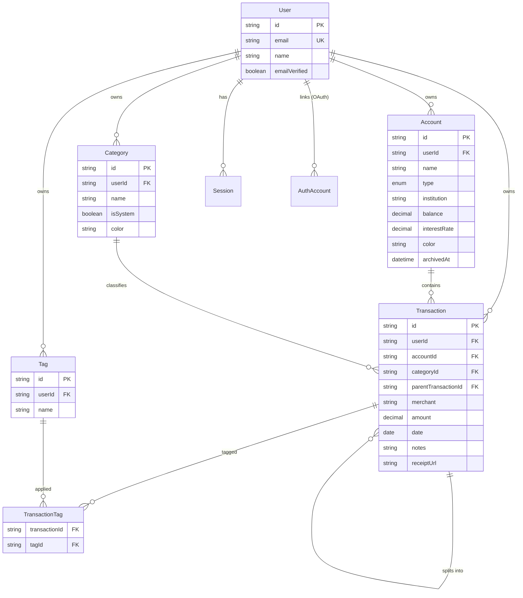

# FinanceOS — ER Diagram (Phase 0 + Phase 1)

## Design notes

- **`Account.type` is a single enum** covering all seven account kinds (checking → crypto) rather than separate tables per type. This is deliberate (risk-register.md #1): Phase 3's Debt Tracker and Investments features will extend the *same* `Account` rows (e.g. a `CREDIT_CARD` account gains debt-specific fields via a related `DebtDetail` table in Phase 3, not a schema rewrite).
- **`Account` is soft-deleted** (`archivedAt`) — a hard delete would cascade-orphan transaction history needed for lifetime analytics and tax reports (Phase 4).
- **`Category` is per-user, not global**, with an `isSystem` flag distinguishing the Charter's fixed 11-category starter set (seeded per user at signup — see `prisma/seed.ts`'s `DEFAULT_CATEGORIES`) from user-added categories. This trades a small amount of row duplication for simplicity: every user can freely rename/delete their own categories without a global-vs-personal-override system, which would be over-engineering for a feature that's still just Phase 1 seed data.
- **Split transactions are self-referential** on `Transaction` (`parentTransactionId`). A sum-equals-parent-amount constraint is enforced in application code (`features/transactions/server/service.ts`), not the database, since Prisma/Postgres can't express a cross-row aggregate check constraint declaratively without a trigger — a trigger is more operational complexity than this needs right now.
- **`TransactionTag` is an explicit join table**, not Prisma's implicit m-n, so it can grow fields (e.g. `taggedAt`) without a migration that changes the relation's shape.
- **Better Auth's `User`/`Session`/`AuthAccount`/`Verification` models** use the exact field names/table mappings the adapter expects — do not rename without checking Better Auth's Prisma adapter docs first.
