# FinanceOS — ER Diagram (Phase 0 + Phase 1 + Phase 2 + Phase 3a)

```mermaid
erDiagram
    User ||--o{ Account : owns
    User ||--o{ Transaction : owns
    User ||--o{ Category : owns
    User ||--o{ Tag : owns
    User ||--o{ Session : has
    User ||--o{ AuthAccount : "links (OAuth)"
    User ||--o{ Budget : owns
    User ||--o{ Goal : owns
    User ||--o{ Bill : owns
    User ||--o{ Notification : owns
    User ||--o{ Receipt : owns

    Account ||--o{ Transaction : contains

    Category ||--o{ Transaction : classifies
    Category ||--o{ BudgetCategory : "budgeted as"
    Category ||--o{ Bill : "optionally categorizes"

    Transaction ||--o{ Transaction : "splits into"
    Transaction ||--o{ TransactionTag : tagged
    Tag ||--o{ TransactionTag : applied
    Transaction ||--o{ Receipt : "has attached"
    Transaction ||--o| BillOccurrence : "optionally backs"

    Budget ||--o{ BudgetCategory : allocates
    BudgetCategory ||--o{ Notification : "triggers (BUDGET_OVER)"

    Goal ||--o{ GoalContribution : accumulates

    Bill ||--o{ BillOccurrence : generates
    BillOccurrence ||--o{ Notification : "triggers (BILL_DUE_SOON / BILL_LATE)"

    User ||--o{ Debt : owns
    User ||--o{ Holding : owns
    User ||--o{ HoldingValueHistoryEntry : owns
    User ||--o{ DividendEntry : owns
    User ||--o{ IncomeStream : owns
    User ||--o{ IncomeOccurrence : owns
    User ||--o{ IrregularIncomeEvent : owns
    User ||--o{ NetWorthSnapshot : owns

    Account ||--o| Debt : "optionally linked to (Credit Card only)"
    Account ||--o{ Holding : contains

    Holding ||--o{ HoldingValueHistoryEntry : "records value changes"
    Holding ||--o{ DividendEntry : "receives dividends"

    IncomeStream ||--o{ IncomeOccurrence : generates
    IncomeStream ||--o{ IrregularIncomeEvent : logs

    Transaction ||--o| IncomeOccurrence : "optionally backs"
    Transaction ||--o| IrregularIncomeEvent : "optionally backs"

    User {
        string id PK
        string email UK
        string name
        boolean emailVerified
    }

    Account {
        string id PK
        string userId FK
        string name
        enum type
        string institution
        decimal balance
        decimal interestRate
        string color
        datetime archivedAt
    }

    Category {
        string id PK
        string userId FK
        string name
        boolean isSystem
        string color
    }

    Tag {
        string id PK
        string userId FK
        string name
    }

    Transaction {
        string id PK
        string userId FK
        string accountId FK
        string categoryId FK
        string parentTransactionId FK
        string merchant
        decimal amount
        date date
        string notes
    }

    TransactionTag {
        string transactionId FK
        string tagId FK
    }

    Budget {
        string id PK
        string userId FK
        date month
    }

    BudgetCategory {
        string id PK
        string budgetId FK
        string userId FK
        string categoryId FK
        decimal amount
    }

    Goal {
        string id PK
        string userId FK
        string name
        decimal targetAmount
        date targetDate
        decimal plannedMonthlyContribution
        datetime archivedAt
    }

    GoalContribution {
        string id PK
        string goalId FK
        string userId FK
        decimal amount
        date date
    }

    Bill {
        string id PK
        string userId FK
        string categoryId FK
        string name
        decimal expectedAmount
        date dueDate
        enum schedule
        datetime archivedAt
    }

    BillOccurrence {
        string id PK
        string billId FK
        string userId FK
        string transactionId FK
        date dueDate
        decimal paidAmount
        date paidDate
    }

    Notification {
        string id PK
        string userId FK
        string budgetCategoryId FK
        string billOccurrenceId FK
        enum type
        datetime readAt
        datetime dismissedAt
    }

    Receipt {
        string id PK
        string userId FK
        string transactionId FK
        string url
        string key
        string name
        int size
        string mimeType
    }

    Debt {
        string id PK
        string userId FK
        string accountId FK "nullable, unique"
        string name
        enum type
        decimal balance
        decimal interestRate
        decimal minimumPayment
        datetime archivedAt
    }

    Holding {
        string id PK
        string userId FK
        string accountId FK
        string name
        enum assetType
        enum sector "nullable"
        decimal costBasis
        decimal currentValue
        datetime closedAt
    }

    HoldingValueHistoryEntry {
        string id PK
        string userId FK
        string holdingId FK
        decimal previousValue
        decimal newValue
        datetime recordedAt
    }

    DividendEntry {
        string id PK
        string userId FK
        string holdingId FK
        decimal amount
        date date
    }

    IncomeStream {
        string id PK
        string userId FK
        string name
        enum type
        enum schedule
        decimal expectedAmount "nullable"
        date anchorDate "nullable"
        datetime archivedAt
    }

    IncomeOccurrence {
        string id PK
        string streamId FK
        string userId FK
        string transactionId FK "nullable, unique"
        date expectedDate
        decimal receivedAmount
        date receivedDate
    }

    IrregularIncomeEvent {
        string id PK
        string streamId FK
        string userId FK
        string transactionId FK "nullable, unique"
        decimal amount
        date date
    }

    NetWorthSnapshot {
        string id PK
        string userId FK
        datetime capturedAt
        date capturedDate "unique per user, per day"
        decimal totalAccountBalance
        decimal totalUnlinkedDebtLiability
        decimal totalNetWorth
    }
```



## Design notes (Phase 0/1)

- **`Account.type` is a single enum** covering all seven account kinds (checking → crypto) rather than separate tables per type. This is deliberate (risk-register.md #1): Phase 3a's Debt Tracker and Investments features extend this design without a schema rewrite. **Correction to this note's original wording (Database Architect, Phase 3a):** the parenthetical above ("a `CREDIT_CARD` account gains debt-specific fields via a related `DebtDetail` table") was illustrative precedent only, written before any Phase 3a product spec existed, and was explicitly flagged by the Product Owner as non-binding (see Architecture.md's "Phase 3a — the Account-linkage handoff"). The actual Phase 3a decision, made fresh against `debt-tracker.md`/`investments.md`, is different in shape: **no `DebtDetail` table exists.** Debt is a standalone `Debt` model with an optional link to `Account` (see "Design notes (Phase 3a)" below for the full reasoning) — not fields grafted onto `Account` itself. This bullet is left here, corrected, rather than deleted, so a future reader searching for "DebtDetail" finds the correction instead of a dangling reference.
- **`Account` is soft-deleted** (`archivedAt`) — a hard delete would cascade-orphan transaction history needed for lifetime analytics and tax reports (Phase 4).
- **`Category` is per-user, not global**, with an `isSystem` flag distinguishing the Charter's fixed 11-category starter set (seeded automatically per user at signup, via a Better Auth `databaseHooks.user.create.after` hook — see `src/features/categories/default-categories.ts`) from user-added categories. This trades a small amount of row duplication for simplicity: every user can freely rename/delete their own categories without a global-vs-personal-override system.
- **Split transactions are self-referential** on `Transaction` (`parentTransactionId`). A sum-equals-parent-amount constraint is enforced in application code (`features/transactions/server/actions.ts`), not the database, since Prisma/Postgres can't express a cross-row aggregate check constraint declaratively without a trigger.
- **`TransactionTag` is an explicit join table**, not Prisma's implicit m-n, so it can grow fields (e.g. `taggedAt`) without a migration that changes the relation's shape.
- **Better Auth's `User`/`Session`/`AuthAccount`/`Verification` models** use the exact field names/table mappings the adapter expects — do not rename without checking Better Auth's Prisma adapter docs first.

## Design notes (Phase 2)

- **`Transaction.receiptUrl` (Phase 1 placeholder) was dropped**, replaced by the one-to-many `Receipt` model below. It could only ever represent a single file and couldn't satisfy the receipt-attachment addendum's "attach one or more files" requirement. Safe to drop outright (not a two-migration rename) since no production data existed and no Phase 1 UI ever wrote to it.
- **Budgeting: "unset" vs. "set to $0" is modeled as row presence, not a nullable column.** No `BudgetCategory` row for a given `(budgetId, categoryId)` means the category has no allocation this month; a row with `amount: 0` means the user deliberately set zero. A lightweight `Budget` "header" row (one per user per calendar month, `@@unique([userId, month])`) anchors each month and lets `getBudgetMonth` answer "was this month ever materialized" (→ real history vs. "no budget was set this month") from the header row's mere existence, without scanning `BudgetCategory`.
- **Savings Goals have no `Account` linkage anywhere** (resolved product decision, 2026-07-19): progress is derived only from `GoalContribution` rows, never a derived account balance, avoiding two independently-maintained numbers drifting or double-counting. `currentProgress`/`percentComplete`/`isCompleted`/`estimatedCompletion` are all computed at read time in `features/goals/server/service.ts`, never stored.
- **Bills use lazy, on-read occurrence generation** (not eager generation of all future occurrences at create/edit time — recurring bills like weekly subscriptions have no natural end date). `BillOccurrence` has `@@unique([billId, dueDate])` so the generator is naturally idempotent across repeated reads. Occurrence status (Upcoming/Due Today/Late/Paid) is never a stored column — always computed at read time from `dueDate`/`paidAmount`/`paidDate`/`transactionId`.
- **A `BillOccurrence` may optionally link to an existing `Transaction`** (resolved product decision, 2026-07-19, over "stay fully separate" and "auto-create a transaction"): `transactionId` is a nullable, unique FK (`onDelete: SetNull`) — at most one Transaction backs one occurrence, enforced at the database level. When linked, the occurrence's effective paid amount/date are read live via the join, never copied, so editing the linked Transaction is automatically reflected with zero write-side sync code; deleting the linked Transaction reverts the occurrence to unpaid.
- **`Notification` is persisted and lazily materialized**, not purely computed at read time or backed by a background job (this app has no job infrastructure). A compute-only design couldn't satisfy the durable-dismiss requirement (dismissing a notification must stick even though its underlying trigger condition hasn't changed) or the per-category/per-occurrence dedup rules — both need a stable row identity, enforced via `@@unique([budgetCategoryId, type])` and `@@unique([billOccurrenceId, type])`.
- **Every new Phase 2 model repeats the direct `userId` FK + index convention** already established in Phase 1 (e.g. `BudgetCategory.userId`, `BillOccurrence.userId`), even where the ownership is also reachable via a parent join (`Budget`, `Bill`) — keeps every user-scoped query and row-level ownership check a single-column lookup, no join required, consistent with how `Transaction.userId` already duplicates what `Transaction.accountId` implies.

## Design notes (Phase 3a)

Six schema decisions were required for this phase (Debt Tracker, Investments, Recurring Income). Each is stated below with the reasoning; the Solution Architect's recommendations (Architecture.md's "Phase 3a — the Account-linkage handoff") were adopted for the first two, since both held up against the actual product specs with no better alternative found.

### 1. Debt <-> Account linkage: hybrid, optional link (Option C) — adopted

`Debt` is a standalone model covering all six `DebtType` values, with `accountId String? @unique` (`onDelete: SetNull`), the same nullable-unique-FK shape already shipped for `BillOccurrence.transactionId`. This was close to a forced move, not a coin flip: three of the four non-credit-card debt types (Personal Loan, Auto Loan, Student Loan, Mortgage) have **no** `Account` counterpart today and never will without adding new `AccountType` enum values (a Phase-1-module change Debt Tracker has no mandate to make). A fully-standalone design (Option B, no link at all) was rejected specifically for the credit-card case: a linked Credit Card Account and its Debt row are *the same real-world balance*, and keeping them as two independently-entered numbers reintroduces exactly the drift risk Savings Goals was designed to avoid (per that model's own resolved note) — except worse, because unlike a goal's progress vs. an account's balance (genuinely different concepts), a debt's balance and its credit card's balance are conceptually identical, so two columns for one fact is pure risk with no offsetting benefit. Extending `Account` itself (Option A) was rejected because it cannot cover the three no-counterpart types without an `AccountType` enum change, and because Debt's required fields (`interestRate` required, `minimumPayment` required) differ in nullability from `Account`'s own (`interestRate` optional, no minimum-payment concept at all) — sharing the table would force nullable-field sprawl onto every non-debt `Account` row.

When `accountId` is set, `Debt.balance` is a stale/unused column — the effective balance is read live via the join in `features/debt/server/service.ts`, never copied, mirroring `BillOccurrence`'s "read live, never copied" precedent exactly. This is why `Debt.balance` stays a required, non-nullable column rather than becoming nullable when linked: the moment a user unlinks, the Debt needs an immediate, sensible fallback value with zero migration/backfill step, seeded by application code from the Account's last-known balance at the moment of unlinking (a one-time copy, not a schema concern).

### 2. Investments <-> Account: grow Account as the container — adopted

Agreed with the Solution Architect's/Product Owner's recommendation. `Account` (Investment/Retirement/Crypto types, already shipped) remains the sole container; `Holding` is a new required child (`accountId String`, non-nullable, `onDelete: Restrict`). No parallel "Investment container" model was introduced — investments.md's own framing ("the real decision here is narrower than link or don't link") is correct: a second container model would duplicate `Account`'s name/institution/color fields for no product benefit, and would force every consumer of "where does a user's brokerage account live" to know about two container types instead of one.

`Holding.accountId` is **required**, unlike `Debt.accountId` which is optional — this asymmetry is deliberate, not an inconsistency. A Debt can meaningfully exist with no Account at all (a mortgage has never had, and will never have, an "Account" row); a Holding has no such standalone case in the product spec — AC1's inline-container-creation flow guarantees a container Account always exists before a Holding is written, so making `accountId` optional would only invite an unreachable, never-populated `null` branch in every downstream query.

### 3. Net Worth double-counting: the query shape `unlinkedDebtLiability` needs

The structural requirement: `debt.service.getTotalActiveDebtBalanceForNetWorth(userId)` must sum only Debts where the link does **not** already have its balance folded into the Account-sum side of the formula. Because `Debt.accountId` is a plain nullable column (not a computed/derived flag), this is a single indexed filter, not a join or subquery:

```sql
SELECT COALESCE(SUM(balance), 0)
FROM debt
WHERE "userId" = $1
  AND "archivedAt" IS NULL
  AND "accountId" IS NULL   -- excludes any Debt already counted via the Account-sum
  AND balance > 0            -- excludes Paid Off (isPaidOff is computed, not stored, but a
                              --   balance of exactly 0 is the same condition either way here)
```

Equivalently in Prisma: `prisma.debt.aggregate({ where: { userId, archivedAt: null, accountId: null, balance: { gt: 0 } }, _sum: { balance: true } })`. The `accountId: null` predicate is the entire double-counting fix — every Personal Loan/Auto Loan/Student Loan/Mortgage Debt has `accountId: null` by construction (no Account counterpart exists to link to), and any Credit Card Debt a user chose to link has `accountId` set and is therefore correctly excluded here (it's already reflected once, correctly, in the ordinary Account-balance sum Dashboard already computes). No additional index beyond `Debt.@@index([userId])` and `accountId`'s own unique index is needed at this feature's expected data volume (a per-user debt list, not a Transaction-scale table) — this is a cheap, single-table, indexed aggregate, not a join.

### 4. Investments' derived balance write-back: accepted as a deliberate exception

Agreed with the Solution Architect's recommendation: `Account.balance` becomes a derived, read-only value once its container has one or more active Holdings, kept in sync by Investments writing it back (in the same transaction as any holding create/update/close) rather than Accounts computing it fresh on every read. The alternative — `accounts.service` checking for holdings and querying Investments dynamically — was rejected because it would make `Account` (the Phase 1 foundational model everything else depends on) depend *forward* into a Phase 3a module, inverting this codebase's entire layering discipline. This is the one narrow, explicitly-documented exception to "never store what's derived" anywhere in this schema, justified specifically because `Account.balance` is the one derived value in this app with pre-existing consumers (Accounts list, Transaction form's account picker, Dashboard's Net Worth sum) built with zero knowledge that Investments would ever exist. No schema field beyond the existing `Account.balance` column is needed to support this — it is purely a write-path discipline requirement for whoever implements `features/investments/server/actions.ts` (must wrap the holding mutation and the `accounts.service.setDerivedBalance` call in one Prisma `$transaction`, so a holding write that succeeds with a failed balance write-back can never happen).

### 5. Bills <-> Recurring Income cross-exclusivity: independent per-table unique FKs + application-level guard, no DB trigger

`BillOccurrence.transactionId`, `IncomeOccurrence.transactionId`, and `IrregularIncomeEvent.transactionId` are each an independent `@unique` nullable FK to `Transaction`, `onDelete: SetNull` — this correctly prevents *that one table* from double-linking a Transaction, but Postgres/Prisma cannot express "at most one row across these three tables" as a single declarative constraint (no cross-table unique index exists in Postgres without a trigger or a shared polymorphic link table). Two stronger options were considered and rejected in favor of the application-level guard (`lib/transaction-link-guard.ts`, per Architecture.md):

- **A shared polymorphic link table** (e.g. one `TransactionLink { transactionId @unique, linkedType, linkedId }` table all three domains write to instead of their own `transactionId` column) would give a single, real database-enforced constraint. Rejected for this phase: it would require rewriting the already-shipped, CTO-approved `BillOccurrence.transactionId` shape (a real migration touching production-shape Phase 2 data, not just additive Phase 3a growth), for a benefit (closing a race window that is vanishingly unlikely to ever be hit in practice — see below) that doesn't justify the churn or the loss of the simple, direct, already-proven per-table `@unique` pattern everywhere else in this schema.
- **A Postgres trigger** enforcing the cross-table check at the database level was considered and **not added this phase**. Reasoning: the realistic race window is a single user, in their own authenticated session, clicking "link" on the same Transaction in two different domains within milliseconds of each other — an edge case, not a concurrent-write-heavy path (contrast with e.g. a payment processor's double-charge risk, where concurrent writes from multiple sources are the normal case). The per-table `@unique` constraints already prevent the *far* more likely failure mode (double-linking within one domain); the narrow cross-domain race is closed at the application layer by having `lib/transaction-link-guard.ts`'s check-then-link run inside a single Prisma `$transaction` (Backend Engineer's implementation responsibility, flagged here so it isn't dropped). Given both specs' own success metrics explicitly track "zero reported incidents of a Transaction backing two occurrences," this is a monitored risk, not an unmonitored one — if it is ever actually hit in production, a trigger (or the polymorphic-table redesign above) should be revisited then, against a real incident rather than a hypothetical one. This is a final decision for this phase, not left open for Backend Engineer to re-litigate.

### 6. `NetWorthSnapshot`: the first not-request-triggered write path

Modeled with a direct `userId` FK (still required — this is still user-owned data, eventually read by that user's own Phase 3b chart) but with an explicit doubled date representation: `capturedAt` (precise timestamp, for display/ordering) and `capturedDate` (`@db.Date`, UTC-truncated, `@@unique([userId, capturedDate])`). The unique constraint is the idempotency guard for a cron invocation that runs more than once in a day (a retry after a timeout, or a scheduler misconfiguration) — without it, a double-invocation would silently write two rows for the same day, corrupting the Phase 3b chart's "one point per day" assumption. This mirrors `BillOccurrence`'s `@@unique([billId, dueDate])` idempotency precedent, applied to a different kind of "don't double-generate on re-invocation" problem (time-triggered rather than read-triggered). `totalNetWorth` is stored explicitly rather than always being recomputed at read time from the other two columns — deliberately, so a future change to the Net Worth formula itself (e.g. if Phase 3b adds a new liability/asset category) never silently rewrites the *historical* meaning of a past snapshot; each row is a frozen statement of "what the formula produced on this day," not a live view.

### 7. Post-gate-review addition: `Holding.@@index([accountId, closedAt])`

Flagged by the Performance Engineer's Phase 3a gate review, not an original design decision above. `Holding` previously carried only the two single-column indexes (`@@index([userId])`, `@@index([accountId])`); every hot path against this table actually filters on `(accountId, closedAt)` together — `features/investments/server/actions.ts`'s `recalculateContainerBalance` (`tx.holding.aggregate({ where: { userId, accountId, closedAt: null }, _sum: { currentValue: true } })`), which runs on every single Holding create/update/close and is therefore this table's single most frequently executed query, plus two read paths in `service.ts` scoped the same way: `getContainers`'s `_count` subquery (`holdings: { where: { closedAt: null } }`) and `getHoldingsForContainer`'s active/Closed list. A single-column `accountId` index still forces a filter step over every row (active and Closed) in a container to find the `closedAt` match; the composite index lets Postgres satisfy the whole predicate directly from the index, and — since `closedAt` is a leading-adjacent column in the same index — serve the `_sum`/`_count` aggregations from the index alone.

Non-urgent at current scale (investments.md's own framing: "a handful of holdings per container"), but cheap to add in the same migration window as other Phase 3a follow-ups rather than deferred. Added via migration `20260721132204_add_holding_account_closed_index`; no other column, model, or relationship changed alongside it.

### Holding/IncomeStream soft-delete: `closedAt`/`archivedAt` added to both, per precedent

Both represent user-entered records with history the user might want to hide without losing (Holding's Closed state per investments.md AC5; IncomeStream's archive per recurring-income.md AC6) — the same shape as `Bill.archivedAt`/`Goal.archivedAt`. `Holding` uses `closedAt` rather than `archivedAt` purely to match that feature's own product vocabulary ("Closed," never "archived," anywhere in `investments.md`) — the mechanism (a nullable timestamp, never a hard delete, full history retained) is identical. `IncomeOccurrence` and `IrregularIncomeEvent` do **not** get their own soft-delete column — they are generated/logged rows under an `IncomeStream`, and archiving the parent stream is sufficient to stop future generation while every past occurrence/event remains queryable regardless of the parent's `archivedAt`, exactly matching how `BillOccurrence` rows have no archive column of their own under an archived `Bill`.

### Debt payoff math: schema fields confirmed sufficient

`payoff-math.ts`'s `computeAmortization`/`compareSnowballAndAvalanche` need exactly three numeric inputs per debt — `balance`, `interestRate`, `minimumPayment` — all three present and required (non-nullable) on `Debt`. Nothing else needs to be persisted: payoff date, total interest remaining, negative-amortization detection, and the snowball/avalanche comparison are all pure functions of these three fields (plus a client-supplied, never-persisted `extraPayment` for the comparison view) and are never stored, matching this schema's rule everywhere else (Goal progress, Budget Health Score, Bill/Income occurrence status). Nothing is flagged as missing.
